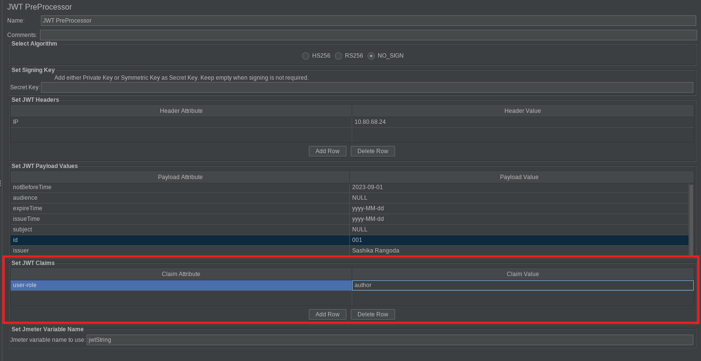
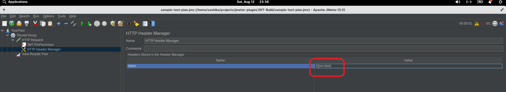

# JWT-PreProcessor
A Jmeter pre-processor plugin. 

## Overview
This is a Jmeter pre-processor plugin that can generate Java Web Token (JWT). When a JWT requires as a pre-requisite
to send an HTTP request, this plugin can generate the JWT based on the details provided by
the user. The JWT token is stored in a Jmeter variable which can use in the following samplers.

### Step to use JWT-PreProcessor

1. Install the plugin in Jmeter
2. Add JWT-PreProcessor into the desired sampler
3. Set the details for JWT 
4. Use the variable whenever the JWT is required.

#### 1. Install Plugin
    a - Install via Jmeter Plugin Manager. Just search JWT PreProcessor in the plugin manager and install it.
    b - Download the jar file and copy it into your <your-jmeter-folder>/lib/ext location and restart the
        Jmeter.
    c - Download the project and execute mvn clean package command and it will build the jar in the target.
        Note - You need to install Java and Maven in your development environment. This plugin is built
        and tested in JDK 17 and Jmeter 5.5 and 5.6 versions.

#### 2. Add JWT-PreProcessor into the HTTP sampler

    a - Create a Thread Group.
    b - Add the HTTP Sampler Add->Pre Processors->JWT PreProcessor
 

#### 3. Set Details
    a - Select the required algorithm for signing. 
            HS256 - HMAC with SHA-256, Symmetric Key Algorithm
            RS256 - RSA Signature with SHA-256, Asymmetric Key Algorithm which uses Private Key/ Public Key
            No-SIgn - When signing is not required.
    b - Give the Secret Key in the text field.
            If you select the algorithm as HS256 then the secret key is the Symmetric Key.
            If you select the algorithm as RS256 then the secret key is the Private Key.
            Keep the text field blank, when you do not need to sign.

    c - Add custom header attributes into the JWT token. This is an optional field. You can click Add button
        to insert a new row into the table. Inputs are taken as Key - A value pair.

    d - Add JWT payload data. In this table you can not change the payload attributes, only values are 
        allowed to insert here, however, values are not mandatory to add. The values associated with dates
        should follow the given format.

    e - For any custom attribute requires to add to the payload, you can set it in the JWT Claims table. This
        is also optional to insert the values. 

    f - Give the variable name to use in the text field. The generated Java Web Token will be stored as
        Jmeter variable which is given here. 

    g - Sample jmx file(sample-test-plan.jmx) is copied in the project folder.

#### 4. How to Use

    a - Add Http Header Manager into the HTTP Sampler request. Create a one-header request as a token and 
        give the Jwt Variable as the value.

    b - Run the test plan and in the results tree listener then select the Http Request -> under Request
        tab select http. Then you can see the generated token.

    c - To verify the details paste the token in https://jwt.io/ 

